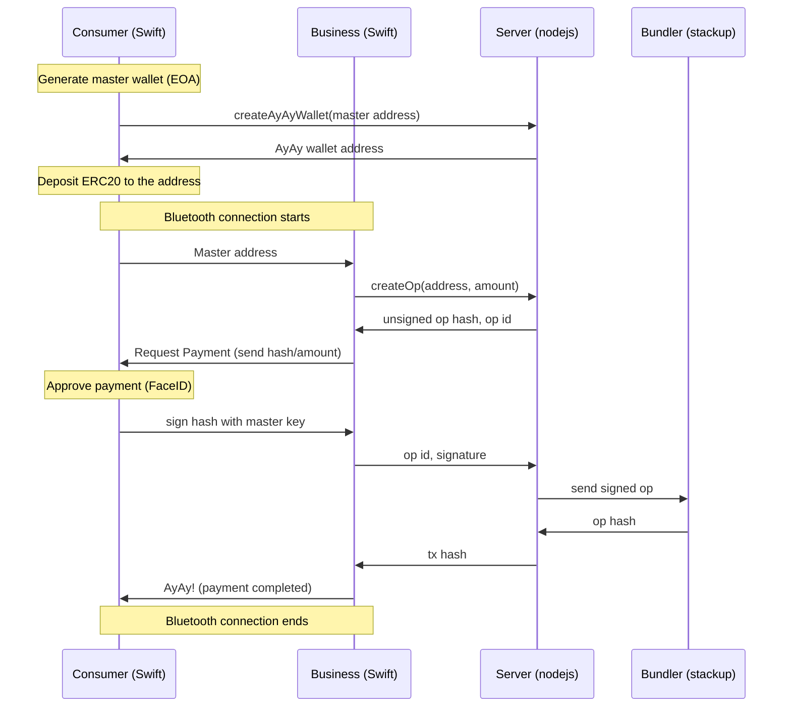

# AyAy Project

AyAy is account abstraction wallet (ERC-4337 compliant) for daily payments. 

With the native interfaces, the payment process is as easy as PayPay, which is widely accepted at stores in Japan (more than 55 million downloads).

Payer can be offline!

## Key Points
- AA Contracts
  - Business entity sponsors gas if only the payment is for it
  - Wallet has withdrawal limit to avoid a significant loss
- Use bluetooth when signing user operations so that consumers can be offline
- Signing key will never go out from the consumer app
- FaceID to approve payments

## Structure

## Deployed contracts

### Polygon mumbai

|Name|Address|Note|
| :--- | :--- | :--- |
| `EntryPoint` | `0x0576a174D229E3cFA37253523E645A78A0C91B57` | Already deployed |
| `AyAyFactory` | `0xc1C84de4313b270D0e2299C36D4D90ddfC3A7C9e` ||
| `AyAyReceiver` | `0x17846F6BFA76c1D7D08873148C9813b6B1D98ce7` | Each shop deploys |
| `AyAyPaymaster` | `0xa7A67146470571E4183D8E9219DBb4674D831B55` | Each shop deploys|
| `AyAyWallet`| `0x1De29a647d9826232a55A84f9154F4fF3E396e14` | One created from the factory |
| `TestJPYC`| `0xF7f571309c7BFc2E6565cA6Ca13c093D78BcF90f` | ERC20 |

## Future improvements
- Support multi chain
- Use NFC to make UX better