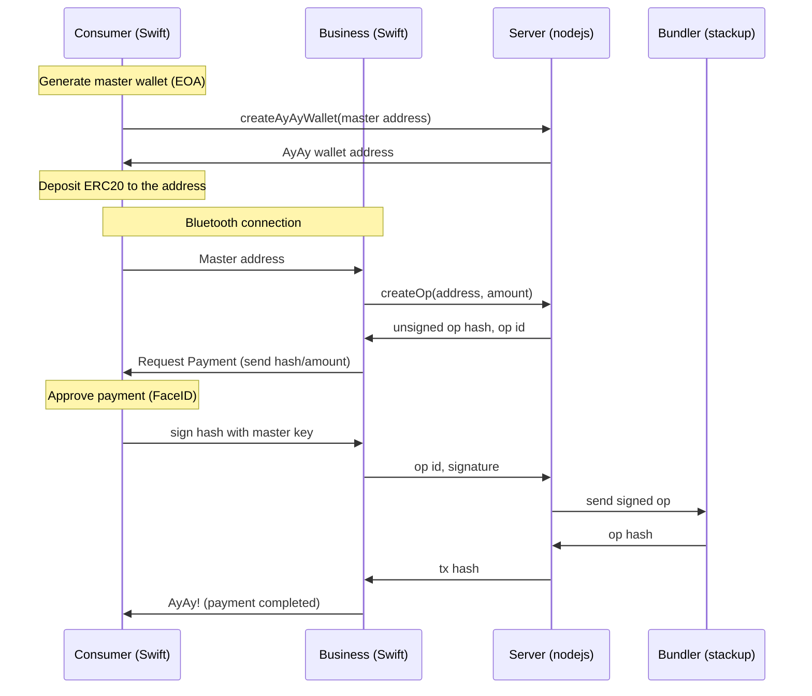

# AyAy Project

AyAy is account abstraction wallet (ERC-4337 compliant) for daily payments. 

With the native interfaces, the payment process is as easy as PayPay, which is widely accepted at stores in Japan (more than 55 million downloads).

Payer can be offline!

- Contracts
  - Business entity sponsors gas if only the payment is for the entity
  - Wallet has withdrawal limit to avoid a significant loss
- Consumer (payer) interface in swift
- Business (payee) interface in swift
- Use bluetooth when signing user operations so that consumer can be offline
- Server (nodejs) to send user ops + utils
- Signing key will never go out from the consumer app
- FaceID to approve payments

