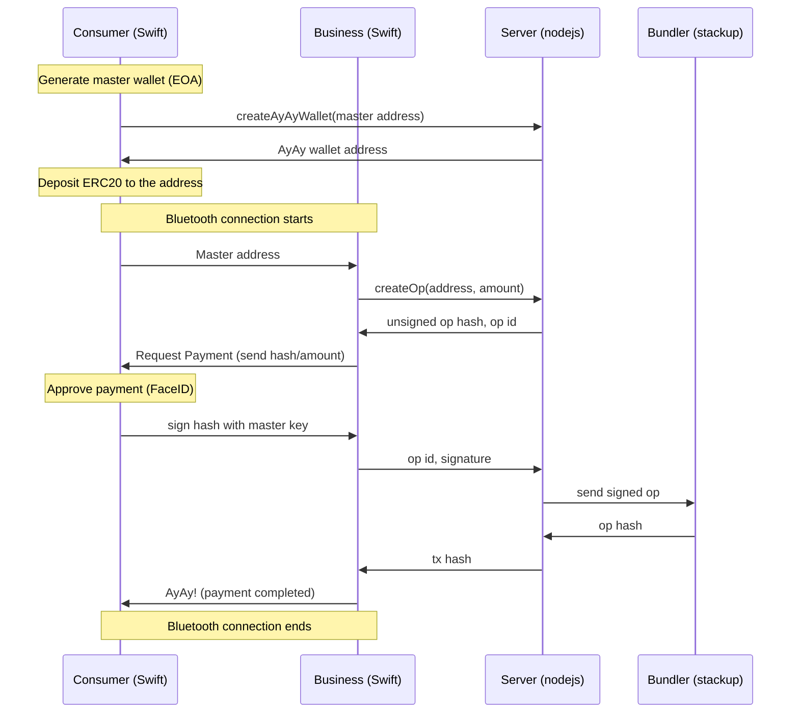

# AyAy Project

AyAy is account abstraction wallet (ERC-4337 compliant) for daily payments.

With the native interfaces, the payment process is as easy as PayPay, which is widely accepted at stores in Japan (more than 55 million downloads).

Payer can be offline!

## Key Points

- AA Contracts
  - Business entity sponsors gas if only the payment is for it
  - Wallet has withdrawal limit to avoid a significant loss
- Use bluetooth when signing user operations so that consumers can be offline
- Signing key will never go out from the consumer app
- FaceID to approve payments

## Structure

## Deployed contracts

### Polygon mumbai

| Name            | Address                                      | Note                         |
| :-------------- | :------------------------------------------- | :--------------------------- |
| `EntryPoint`    | `0x0576a174D229E3cFA37253523E645A78A0C91B57` | Already deployed             |
| `AyAyFactory`   | `0xc1C84de4313b270D0e2299C36D4D90ddfC3A7C9e` |                              |
| `AyAyReceiver`  | `0x17846F6BFA76c1D7D08873148C9813b6B1D98ce7` | Each shop deploys            |
| `AyAyPaymaster` | `0xa7A67146470571E4183D8E9219DBb4674D831B55` | Each shop deploys            |
| `AyAyWallet`    | `0x1De29a647d9826232a55A84f9154F4fF3E396e14` | One created from the factory |
| `TestJPYC`      | `0xF7f571309c7BFc2E6565cA6Ca13c093D78BcF90f` | ERC20                        |

### Bunzz

- Each shop can easily deploy their own AyAyReceiver contract using Bunzz.
- Video example: https://drive.google.com/file/d/1fW2ILnVorL1Eq7uoa3GukV6VpoCuusYc/view

## Future improvements

- Support multi chain
- Use NFC to make UX better

## FOR EthTokyo Polygon Prize

### Prize for Best Public Good with Account Abstraction or Gasless transactions

- UX optimization strategies

  To improve the UX of the AyAy project, the following points are important:

  - Offline Payment :
    Offline payments allow users to continue making payments even when they don't have access to the app. This reduces limitations on app usage and enables users to make payments more conveniently.

  - Elimination of Gas Fees :
    Eliminating gas fees associated with transactions is a significant improvement in UX as it reduces the cost of transactions for users and eliminates the complexity of managing gas fees.

  - Global Availability :
    The AyAy project aims to be available globally, allowing users to make payments with their preferred currency from anywhere in the world. This makes the app more accessible and convenient for users.

  - Multi-Currency Support :
    Multi-currency support is another significant UX improvement, as it allows users to make payments in their preferred currency, reducing the need for currency conversions and providing greater flexibility.

  - Limitation of Withdrawal Amounts :
    Setting limits on the amount that can be withdrawn from a wallet helps to improve the security of the app by reducing the potential loss in case of a security breach.

  - Improved Security :
    Improved security features such as Bluetooth-enabled signing, FaceID integration, and the use of AA contracts, help to ensure that user information is protected and transactions are secure. This is crucial in building trust with users and ensuring the app is widely adopted.

- Link to relevant sections of code with your account abstraction implementation.
  https://github.com/iharuya/ayay/tree/main/contract/contracts

### Prize for Build #onPolygon in Public Pool Prize

- Link to our deployed smart contracts on Polygonscan

  | Name            | Polygonscan                                                                         | Note                         |
  | :-------------- | :---------------------------------------------------------------------------------- | :--------------------------- |
  | `EntryPoint`    | `https://mumbai.polygonscan.com/address/0x0576a174D229E3cFA37253523E645A78A0C91B57` | Already deployed             |
  | `AyAyFactory`   | `https://mumbai.polygonscan.com/address/0xc1C84de4313b270D0e2299C36D4D90ddfC3A7C9e` |                              |
  | `AyAyReceiver`  | `https://mumbai.polygonscan.com/address/0x17846F6BFA76c1D7D08873148C9813b6B1D98ce7` | Each shop deploys            |
  | `AyAyPaymaster` | `https://mumbai.polygonscan.com/address/0xa7A67146470571E4183D8E9219DBb4674D831B55` | Each shop deploys            |
  | `AyAyWallet`    | `https://mumbai.polygonscan.com/address/0x1De29a647d9826232a55A84f9154F4fF3E396e14` | One created from the factory |
  | `TestJPYC`      | `https://mumbai.polygonscan.com/address/0xF7f571309c7BFc2E6565cA6Ca13c093D78BcF90f` | ERC20                        |

- Link to our tweet

  https://twitter.com/AyAy_wallet/status/1647332790910996480
